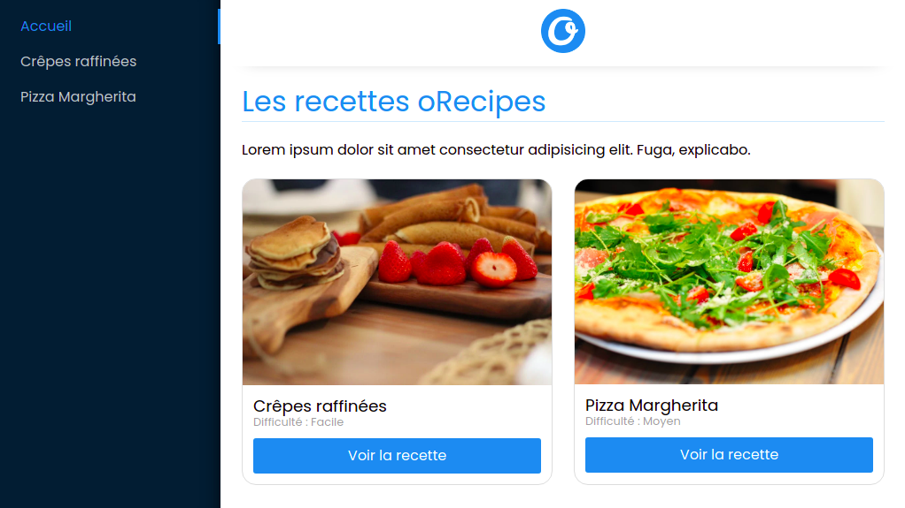
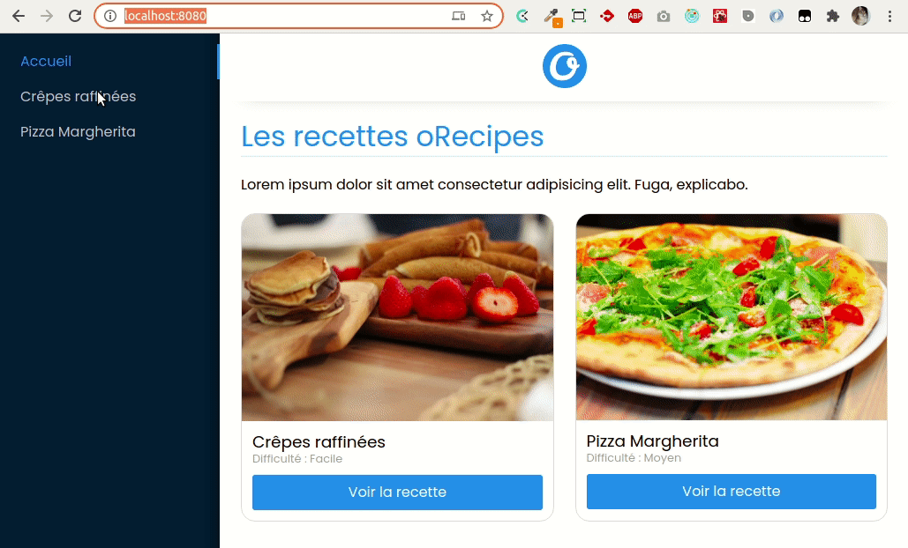

# oRecipes

_Pour démarrer ce projet, récupère la config du react-modele puis analyse les composants fournis dans `/src`._  
_Tu devras installer les dépendances `@reduxjs/toolkit`, `react-redux`et également `react-router-dom`_  
_Tu auras également besoin du dépôt de l'api des recettes pour l'étape 3._

Salut _[insère ton nom ici]_, il paraît que t'es le nouveau.

Bienvenue chez oRecipes, on lance bientôt notre nouvelle application de recettes et on a fait appel à toi pour renforcer notre équipe.

Tu interviendras sur notre application qui utilise React, Redux et React Router :tada:

## Étape 1 : On analyse et on répare

Pour poser les bases du nouveau projet on a fait appel à un cador de la boîte. Mais là, il est occupé ailleurs.

Je te transfère ses explications, vois ce que tu peux faire, moi j'y connais rien.

```text
Fwd: Objet: Développement d'oRecipes

La base est posée mais j'ai dû m'arrêter en cours de route, 
il reste quelques soucis à régler avant de voir la suite.

- J'ai cassé quelque chose à la dernière minute, 
ça doit pas être grand chose tout marchait bien jusque là, faut qu'on regarde.

- L'affichage du logo est cassé, j'ai pas eu le temps de voir pourquoi.

- La difficulté ne s'affiche pas sur l'accueil en dessous du titre de chaque recette.

Cordialement
Vincent F.
```

J'espère que ça te suffira, Vincent est pas trop dispo. Tiens voilà la maquette graphique pour que tu vois ce que ça doit donner.



## Étape 2 : Router

Tu as tout réparé ?

Bon pour la suite je te transfère un email de Vincent

```text
Fwd: Re: Objet: Développement d'oRecipes

Pour briefer le nouveau sur le projet. 
Tu peux lui dire que j'ai préparé tout le nécessaire pour la page d'une Recette en plus de l'accueil.
Il a du voir le code commenté dans le composant racine.

Il faut qu'il mette en place le routeur pour afficher la bonne vue en fonction de l'url, j'espère qu'il connait les hooks de react-router. 
Il faudra sûrement adapter les liens.

S'il a le temps de gérer la vue d'erreur ça serait bien aussi.

Cordialement
Vincent F.
```

Je te mets l'animation du premier prototype pour que tu vois


## Étape 3 : Store

Le routeur est en place ?

Vincent a pu mettre en place l'api de développement pendant que tu t'occupais de l'interface.

Je te transfère son email

```text
Fwd: Re: Objet: Développement d'oRecipes

Salut le nouveau,

Je suis sûr que le boss va encore te transférer mon email sans même le lire.

Le store créé avec Redux est en place sur le projet. 

Tu peux arrêter d'utiliser les data bidons de `src/data.js` et récupérer l'api de développement pour le projet oRecipes.
Mets en place la récupération des données via l'api dans un middleware de redux thunk.
Tu auras la liste sur le endpoint `/recipes` en GET

Cordialement
Vincent F.
```

## Bonus

J'ai regardé ton travail et j'ai une remarque. Vincent n'a pas répondu à mon email.

Peux-tu t'en occuper directement ?

J'ai remarqué que lorsqu'on scrolle dans la page, par exemple sur une recette. Si ensuite on change de recette, on ne revient pas en haut de la page.

J'aimerai qu'à chaque changement de page on remette le défilement de la page en haut.
